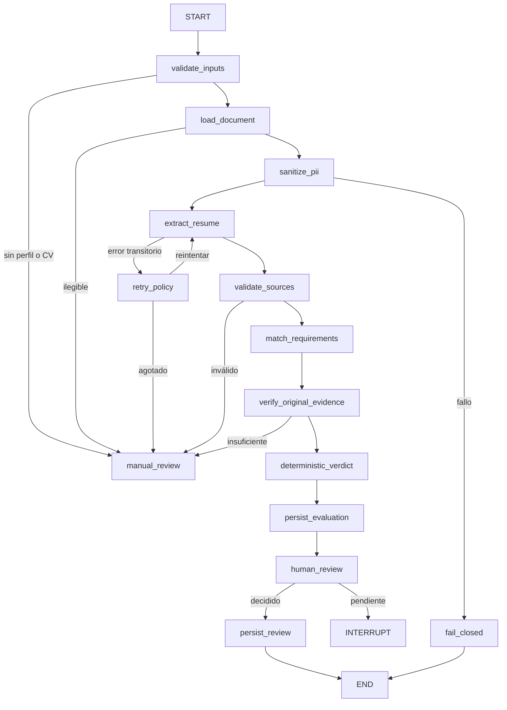

# TalentIA — Implementation Specification

## Estado

Approved for implementation

## Metodología

Spec-Driven Development

## Tipo de implementación

Greenfield — nueva implementación desde cero

## 1. Objetivo y fuentes de verdad

Construir TalentIA desde cero con la arquitectura aprobada y alcanzar el 100 % de la rúbrica funcional y técnica. Este documento es la fuente ejecutable para implementar el producto tarea por tarea mediante `IMP-XXX`.

Orden de autoridad:

1. `TalentIA_informacion_extraida_consolidada_v4.md` y `extraccion_talentia_imagenes (1).md`, usados exclusivamente como rúbrica.
2. La arquitectura y el stack aprobados en la auditoría anterior.
3. Este `IMPLEMENTATION_SPEC.md`.
4. El repositorio anterior, solo como referencia funcional y fuente potencial de piezas reutilizables.

Los dos Markdown de rúbrica no se copiarán a `/specs`, no se modificarán y no se considerarán archivos internos del proyecto. La nueva arquitectura no conservará compatibilidad con código, API o tablas anteriores.

## 2. Decisiones de negocio pendientes

| ID | Decisión | Estado |
|---|---|---|
| BIZ-001 | Vigencia por motivo de descarte | BLOCKED — REQUIERE DEFINICIÓN DE NEGOCIO |
| BIZ-002 | Condiciones y roles para reabrir `NO APTO` | BLOCKED — REQUIERE DEFINICIÓN DE NEGOCIO |
| BIZ-003 | Rol autorizado para revertir `BLACKLIST` | BLOCKED — REQUIERE DEFINICIÓN DE NEGOCIO |
| BIZ-004 | Umbral inicial de similitud de nombres | BLOCKED — REQUIERE DEFINICIÓN DE NEGOCIO |
| BIZ-005 | Tratamiento de un requisito obligatorio sin evidencia | BLOCKED — REQUIERE DEFINICIÓN DE NEGOCIO |
| BIZ-006 | Definición y ventana temporal de “CV útil” | BLOCKED — REQUIERE DEFINICIÓN DE NEGOCIO |
| BIZ-007 | Retención y eliminación de CV, PII, evaluaciones y auditoría | BLOCKED — REQUIERE DEFINICIÓN DE NEGOCIO |
| BIZ-008 | Alcance de unicidad de identidad: global o por cliente | BLOCKED — REQUIERE DEFINICIÓN DE NEGOCIO |
| BIZ-009 | Correspondencia final entre estado de candidato y postulación | BLOCKED — REQUIERE DEFINICIÓN DE NEGOCIO |
| BIZ-010 | Almacenamiento, acceso y retención de BGC y Equifax | BLOCKED — REQUIERE DEFINICIÓN DE NEGOCIO |

Ningún agente debe inventar estas decisiones. Las funcionalidades afectadas permanecerán deshabilitadas o pendientes de revisión hasta resolverlas.

## 3. Arquitectura y stack aprobados

| Componente | Decisión |
|---|---|
| Arquitectura | Monolito modular greenfield |
| Backend | Python, FastAPI y Uvicorn |
| Frontend | Jinja2, HTMX, Bootstrap local y JavaScript mínimo |
| Dominio y schemas | Python y Pydantic |
| Persistencia | SQLAlchemy y Alembic |
| Base de datos | SQLite con WAL |
| Agentes | AG-01/04/05 determinísticos; AG-02/03 híbridos |
| Orquestación | LangGraph Python solo para AG-02/AG-03 |
| Trabajo IA | Worker Python y tabla durable de trabajos |
| Testing | pytest, API, integración, agentes, workflow, seguridad y E2E |
| Observabilidad | Logs estructurados y métricas persistidas |
| Piloto | Entorno virtual Python y navegador; sin Node.js en runtime |

La máquina del piloto no necesita Docker, Node.js, Redis, RabbitMQ, Kafka, Kubernetes ni PostgreSQL. Las herramientas de lint, tipos y evaluación pertenecen al entorno de desarrollo/CI. Los recursos HTMX y Bootstrap se servirán localmente como archivos estáticos.

## 4. Estructura del nuevo proyecto

```text
TalentIA/
├── pyproject.toml
├── alembic.ini
├── README.md
├── IMPLEMENTATION_SPEC.md
├── .env.example
├── migrations/
│   └── versions/
├── src/talentia/
│   ├── main.py
│   ├── bootstrap.py
│   ├── config.py
│   ├── shared/
│   │   ├── domain/
│   │   ├── application/
│   │   └── infrastructure/
│   ├── modules/
│   │   ├── access/{domain,application,infrastructure,api}/
│   │   ├── candidates/{domain,application,infrastructure,api}/
│   │   ├── recruitment/{domain,application,infrastructure,api}/
│   │   ├── documents/{domain,application,infrastructure,api}/
│   │   ├── evaluations/{domain,application,infrastructure,api}/
│   │   ├── providers/{domain,application,infrastructure,api}/
│   │   ├── reporting/{application,infrastructure,api}/
│   │   └── audit/{domain,application,infrastructure}/
│   ├── ai/
│   │   ├── agents/
│   │   ├── workflows/{state.py,evaluation_graph.py,nodes/}
│   │   ├── prompts/
│   │   ├── schemas/
│   │   ├── guardrails/
│   │   └── adapters/
│   ├── platform/{jobs,security,observability,storage}/
│   └── web/
│       ├── routes/
│       ├── forms/
│       ├── templates/
│       └── static/{css,js,vendor}/
├── tests/{unit,integration,api,agents,workflows,security,concurrency,performance,e2e,golden}/
├── scripts/{start_api.ps1,start_worker.ps1,migrate.ps1,backup.ps1,restore.ps1,verify_pilot.ps1}
└── docs/{architecture.md,data_dictionary.md,api.md,security.md,pilot_runbook.md}
```

## 5. Reglas de arquitectura

1. `domain` no importa FastAPI, SQLAlchemy, LangGraph ni SDK de LLM.
2. `application` define casos de uso y puertos; no importa ORM ni presentación.
3. `infrastructure` implementa puertos; no decide reglas de negocio.
4. API y web no consultan directamente la base de datos.
5. La UI no contiene reglas de identidad, estados, CTC, exclusión o autorización.
6. LangGraph orquesta; no reemplaza el dominio.
7. Las reglas determinísticas nunca se delegan al LLM.
8. Los prompts no contienen reglas que deban existir en Python.
9. Ninguna salida LLM cambia por sí sola el estado final de un candidato.
10. Toda salida LLM se valida estructural y semánticamente.
11. Solo el CV original puede respaldar una evidencia.
12. La sanitización de PII falla de forma cerrada.
13. Todo caso de uso recibe el usuario y alcance por cliente.
14. No se mantiene una transacción SQLite abierta durante una llamada LLM.
15. Las escrituras críticas y su auditoría comparten una unidad de trabajo.
16. Los efectos reanudables son idempotentes.
17. Los datos derivados no son fuentes editables persistidas.
18. El esquema solo cambia mediante Alembic.

## 6. Política de reutilización del sistema anterior

| Clasificación | Uso |
|---|---|
| REUSE | Pieza utilizable sin cambios materiales tras revisión y pruebas |
| PORT | Algoritmo útil trasladado a contratos y estructura nuevos |
| REWRITE | Intención útil cuya implementación anterior no cumple la arquitectura |
| DISCARD | Pieza que no formará parte del sistema nuevo |

Clasificación inicial: extracción PDF/DOCX, schemas estrictos, reglas puras y pruebas útiles serán candidatos a `PORT`; sanitización, evidencia, repositorios, importación y exclusiones serán `REWRITE`; Streamlit, el endpoint monolítico y el fallback simulado serán `DISCARD`. La arquitectura nueva siempre prevalece sobre la reutilización.

## 7. Dominio y modelo de datos

Agregados principales:

- Acceso: `User`, `Role`, `Permission`, `Client`, `UserClientAssignment`.
- Candidatos: `Candidate`, `CandidateIdentity`, `CandidateStatus`, `CandidateEvent`, `FormerEmployeeRecord`.
- Reclutamiento: `JobProfile`, `JobProfileVersion`, `Application`, `RecruitmentSource`, `RejectionReason`.
- Documentos: `CandidateDocument`, `DocumentExtraction`, `FieldSuggestion`, `SourceReference`.
- Evaluación: `Evaluation`, `RequirementAssessment`, `HumanReview`, `FieldCorrection`.
- Proveedores: `ImportBatch`, `ImportRow`, `ImportClassification`, `ExclusionReport`, `ExclusionEntry`.
- Plataforma: `AgentJob`, `WorkflowCheckpoint`, `AuditEvent`, `PilotMetricEvent`.

Tablas: `users`, `roles`, `user_roles`, `clients`, `user_client_assignments`, `candidates`, `candidate_identities`, `candidate_events`, `former_employee_batches`, `former_employees`, `job_profiles`, `job_profile_versions`, `applications`, `candidate_documents`, `document_extractions`, `field_suggestions`, `evaluations`, `requirement_assessments`, `human_reviews`, `field_corrections`, `import_batches`, `import_rows`, `exclusion_reports`, `exclusion_entries`, `agent_jobs`, `workflow_checkpoints`, `audit_events` y `pilot_metric_events`.

La base general manejará los 18 campos de la rúbrica. Edad y porcentaje CTC serán derivados. Cliente y perfil usarán FK. BGC y Equifax serán sensibles. Se requieren unicidad de documento normalizado según BIZ-008, índices de búsqueda, timestamps UTC, FK explícitas, importes decimales, versiones para optimistic locking e idempotency keys únicas.

Migraciones: acceso; candidatos; perfiles/postulaciones; documentos; evaluaciones; lotes/excolaboradores; jobs/checkpoints; auditoría/métricas; índices y constraints finales. Cada una deberá probar creación hasta `head`, FK, constraints y reversión segura.

## 8. Casos de uso y API

Casos de uso: `AuthenticateUser`, `AssignRole`, `AssignClientAccess`, `ResolveCandidateIdentity`, `RegisterCandidate`, `SearchCandidates`, `UpdateCandidate`, `ChangeCandidateStatus`, `GetCandidateTrace`, `CheckFormerEmployee`, `CreateJobProfileVersion`, `CreateApplication`, `AttachResume`, `ExtractResumeData`, `ConfirmFieldSuggestions`, `RequestEvaluation`, `SubmitEvaluationReview`, `StageImportBatch`, `ConfirmImportBatch`, `ImportFormerEmployees`, `CreateExclusionReport` y `GetPilotMetrics`.

Endpoints principales:

| Método y ruta | Caso de uso | Control |
|---|---|---|
| `POST /api/v1/auth/login` | `AuthenticateUser` | Auditar intento |
| `POST /api/v1/auth/logout` | Cerrar sesión | Limpiar sesión |
| `POST /api/v1/candidates/identity-checks` | `ResolveCandidateIdentity` | Alta autorizada |
| `POST /api/v1/candidates` | `RegisterCandidate` | Identity check obligatorio |
| `GET /api/v1/candidates` | `SearchCandidates` | Scope y paginación |
| `GET/PATCH /api/v1/candidates/{id}` | Consulta/edición | Auditoría y versión |
| `POST /api/v1/candidates/{id}/transitions` | `ChangeCandidateStatus` | Motivo y rol |
| `GET /api/v1/candidates/{id}/trace` | `GetCandidateTrace` | Lectura auditada |
| `POST /api/v1/candidates/{id}/resumes` | `AttachResume` | Upload seguro |
| `POST /api/v1/job-profiles/{id}/versions` | Crear versión | Gestor autorizado |
| `POST /api/v1/applications` | `CreateApplication` | Scope por cliente |
| `POST /api/v1/applications/{id}/evaluation-jobs` | `RequestEvaluation` | Devuelve `job_id` |
| `GET /api/v1/jobs/{id}` | Consultar trabajo | Acceso autorizado |
| `GET /api/v1/evaluations/{id}` | Obtener evaluación | Lectura sensible |
| `POST /api/v1/evaluations/{id}/reviews` | Revisión humana | Auditoría |
| `POST/GET /api/v1/import-batches` | Staging/consulta | Importador |
| `POST /api/v1/import-batches/{id}/confirm` | Confirmar lote | Idempotencia |
| `POST /api/v1/former-employees/imports` | Cargar ex-TCS | Rol restringido |
| `POST /api/v1/exclusion-reports` | AG-05 | Cliente y período |
| `GET /api/v1/exclusion-reports/{id}/download` | Descargar CSV | Exportación auditada |
| `GET /api/v1/metrics/pilot` | Métricas | Scope y agregación |

## 9. Agentes y LangGraph

| Agente | Tipo | Regla central |
|---|---|---|
| AG-01 Deduplicación | Determinístico | Identidad antes de registrar; no auto-merge probable |
| AG-02 Lector de CV | Híbrido | Extraer con fuente, confianza y nulos |
| AG-03 Evaluador | Híbrido | LLM propone; Python verifica y decide |
| AG-04 Trazabilidad | Determinístico | Resumen factual e historial |
| AG-05 Exclusión | Determinístico | Elegibilidad a nivel persona y CSV mínimo |

Estado LangGraph: versión, job, candidato, postulación, documento/hash, versión de perfil, extracción, evaluación, resultados por requisito, revisión requerida, error, reintentos y nodos completados. No incluirá objetos ORM, secretos ni CV completo.



## 10. Frontend, seguridad y fallback

Pantallas: login, inicio, base general, alta/edición, candidato 360, clientes, perfiles, postulaciones, CV/precarga, evaluación, revisión humana, lotes, exclusiones, excolaboradores, trabajos, métricas y administración de usuarios.

Reglas UX: identity check antes de guardar; filtros en servidor; derivados solo lectura; fuente/confianza por sugerencia; evidencia por requisito; distinción entre sin evidencia y no cumple; estados de trabajo visibles; conflicto concurrente por campo; fallback manual; logout limpia datos sensibles.

Seguridad: autenticación obligatoria; hash seguro; RBAC; client scope; protección IDOR/CSRF; permisos específicos para BGC/Equifax/exportaciones; uploads con MIME/firma/tamaño; almacenamiento no público; PII sanitizada antes del LLM; atributos protegidos excluidos; CV delimitado como input no confiable; tools no controlables por el CV; structured output; secretos fuera del código; auditoría de escrituras, lecturas completas y exportaciones.

Fallback: timeout, 429, 5xx, proveedor ausente, JSON inválido, resultado inválido, CV ilegible, fallo de anonimización, reinicio y DB ocupada deben dejar el candidato utilizable y ofrecer captura/revisión manual. Nunca se mostrará una simulación como resultado real.

## 11. Fases

| Fase | Alcance | Tareas |
|---|---|---|
| 0 | Bootstrap | IMP-001 a IMP-003 |
| 1 | Dominio | IMP-004 a IMP-009 |
| 2 | Persistencia | IMP-010 a IMP-013 |
| 3 | Casos de uso/API | IMP-014 a IMP-019 |
| 4 | Agentes/LangGraph | IMP-020 a IMP-026 |
| 5 | Frontend | IMP-027 a IMP-029 |
| 6 | Seguridad/auditoría | IMP-030 e IMP-031 |
| 7 | Testing/evaluación IA | IMP-032 |
| 8 | Observabilidad/rendimiento | IMP-033 e IMP-034 |
| 9 | Piloto | IMP-035 |

# 12. Tareas implementables

### IMP-001 — Crear proyecto Python greenfield

**Prioridad:** P0

**Objetivo:** Crear el esqueleto instalable.

**Requisito de la rúbrica:** Piloto ejecutable con Python.

**Dependencias:** Ninguna.

**Componentes/archivos a crear:** `pyproject.toml`, `src/talentia`, configuración, health check y scripts.

**Implementación requerida:** FastAPI, Uvicorn, Pydantic, SQLAlchemy, Alembic y extras opcionales.

**Reglas que debe respetar:** Sin compatibilidad antigua ni Node.js en runtime; IA opcional para modo manual.

**Criterios de aceptación:**
- [ ] Instalación limpia.
- [ ] `/health` responde.
- [ ] Modo manual inicia sin proveedor LLM.

**Pruebas obligatorias:**
- [ ] Smoke de instalación y configuración.

**Definition of Done:**
- [ ] Proyecto ejecutable y dependencias documentadas.

### IMP-002 — Configurar CI y límites arquitectónicos

**Prioridad:** P0

**Objetivo:** Detectar desviaciones automáticamente.

**Requisito de la rúbrica:** Testing y mantenibilidad.

**Dependencias:** IMP-001.

**Componentes/archivos a crear:** Configuración Ruff, tipos, pytest, CI y architecture tests.

**Implementación requerida:** Ejecutar lint, tipos, tests y migraciones.

**Reglas que debe respetar:** Dominio sin frameworks; API sin ORM; IA sin presentación.

**Criterios de aceptación:**
- [ ] CI falla ante dependencias prohibidas.
- [ ] Tests base no requieren red.

**Pruebas obligatorias:**
- [ ] Architecture y CI smoke.

**Definition of Done:**
- [ ] Pipeline aprobado y reglas documentadas.

### IMP-003 — Configuración segura

**Prioridad:** P0

**Objetivo:** Separar desarrollo, test y piloto.

**Requisito de la rúbrica:** Seguridad y secretos.

**Dependencias:** IMP-001.

**Componentes/archivos a crear:** Settings, validadores y `.env.example`.

**Implementación requerida:** Perfiles, rutas, secretos, límites y proveedor IA.

**Reglas que debe respetar:** Piloto no arranca sin auth; sin credenciales hardcodeadas.

**Criterios de aceptación:**
- [ ] Configuración insegura aborta.
- [ ] Secretos no aparecen en logs.

**Pruebas obligatorias:**
- [ ] Unit, startup y security.

**Definition of Done:**
- [ ] Perfiles documentados y validados.

### IMP-004 — Identidad y deduplicación

**Prioridad:** P0

**Objetivo:** Definir identidad canónica.

**Requisito de la rúbrica:** AG-01.

**Dependencias:** IMP-002; BIZ-004/BIZ-008.

**Componentes/archivos a crear:** Value objects y `IdentityResolution`.

**Implementación requerida:** Documento → email → últimos nueve dígitos → nombre normalizado con tokens ordenados.

**Reglas que debe respetar:** Exact/probable/none; sin LLM ni auto-merge probable.

**Criterios de aceptación:**
- [ ] Normalización determinística.
- [ ] Criterio explicable y umbral configurable.

**Pruebas obligatorias:**
- [ ] Unit parametrizado y falsos positivos.

**Definition of Done:**
- [ ] Reglas completas y decisiones BIZ aplicadas.

### IMP-005 — Candidato y base general

**Prioridad:** P0

**Objetivo:** Modelar los 18 campos e historial.

**Requisito de la rúbrica:** Base general.

**Dependencias:** IMP-004.

**Componentes/archivos a crear:** `Candidate`, value objects y eventos.

**Implementación requerida:** Edad y CTC derivados; campos sensibles clasificados.

**Reglas que debe respetar:** Derivados no editables; todo cambio versionado.

**Criterios de aceptación:**
- [ ] Tipos/nulabilidad explícitos.
- [ ] Derivados correctos ante datos ausentes.

**Pruebas obligatorias:**
- [ ] Unit de fechas, CTC y eventos.

**Definition of Done:**
- [ ] Modelo puro y documentado.

### IMP-006 — Estados y transiciones

**Prioridad:** P0

**Objetivo:** Implementar ciclo de reclutamiento.

**Requisito de la rúbrica:** Estados, motivos y reapertura.

**Dependencias:** IMP-005; BIZ-001/002/003/009.

**Componentes/archivos a crear:** Catálogos y política de transición.

**Implementación requerida:** Validar origen, destino, actor, motivo y vigencia.

**Reglas que debe respetar:** `NO APTO` exige motivo; `BLACKLIST` requiere autorización.

**Criterios de aceptación:**
- [ ] Matriz aprobada y reapertura auditada.

**Pruebas obligatorias:**
- [ ] Unit de cada transición y permiso.

**Definition of Done:**
- [ ] Decisiones BIZ resueltas y cobertura completa.

### IMP-007 — Clientes, perfiles y postulaciones

**Prioridad:** P0

**Objetivo:** Modelar relaciones y perfiles versionados.

**Requisito de la rúbrica:** Cliente, requisitos y CTC.

**Dependencias:** IMP-005/006.

**Componentes/archivos a crear:** Agregados correspondientes.

**Implementación requerida:** Versiones inmutables con obligatorios, deseables y CTC.

**Reglas que debe respetar:** Cada evaluación referencia versión; fuente pertenece a postulación.

**Criterios de aceptación:**
- [ ] Versiones no se sobrescriben.
- [ ] Ciclos legítimos son representables.

**Pruebas obligatorias:**
- [ ] Unit de versión e idempotencia.

**Definition of Done:**
- [ ] Invariantes aprobadas.

### IMP-008 — Documentos y evidencia

**Prioridad:** P0

**Objetivo:** Modelar CV, extracción y fuentes.

**Requisito de la rúbrica:** AG-02/03.

**Dependencias:** IMP-005.

**Componentes/archivos a crear:** Documento, extracción, sugerencia y referencia.

**Implementación requerida:** Hash, versión, offset/página y confianza.

**Reglas que debe respetar:** Ausencia es nula; salida generada no es evidencia.

**Criterios de aceptación:**
- [ ] Fuente original por sugerencia.
- [ ] Reemplazo conserva historial.

**Pruebas obligatorias:**
- [ ] Unit de hash y referencias.

**Definition of Done:**
- [ ] Contratos versionados.

### IMP-009 — Evaluación y Human-in-the-Loop

**Prioridad:** P0

**Objetivo:** Modelar evaluación inmutable y feedback.

**Requisito de la rúbrica:** AG-03.

**Dependencias:** IMP-007/008; BIZ-005.

**Componentes/archivos a crear:** Evaluación, assessment, review y corrección.

**Implementación requerida:** Cuatro veredictos, evidencia e incertidumbre.

**Reglas que debe respetar:** Sin decisión laboral autónoma; reevaluación crea versión.

**Criterios de aceptación:**
- [ ] Feedback se vincula a una evaluación.
- [ ] Sin evidencia no se confunde con incumplimiento.

**Pruebas obligatorias:**
- [ ] Unit y revisión concurrente.

**Definition of Done:**
- [ ] BIZ-005 aplicado.

### IMP-010 — Esquema SQLite y migraciones

**Prioridad:** P0

**Objetivo:** Persistir el dominio greenfield.

**Requisito de la rúbrica:** Integridad y relaciones.

**Dependencias:** IMP-004 a IMP-009.

**Componentes/archivos a crear:** Modelos SQLAlchemy y migraciones.

**Implementación requerida:** Tablas, FK, índices, uniques, timestamps y versiones.

**Reglas que debe respetar:** FK activas; importes precisos; migraciones obligatorias.

**Criterios de aceptación:**
- [ ] DB se crea desde cero hasta `head`.
- [ ] Constraints fallan correctamente.

**Pruebas obligatorias:**
- [ ] Migration, FK e índices.

**Definition of Done:**
- [ ] Diccionario de datos actualizado.

### IMP-011 — Repositorios y Unit of Work

**Prioridad:** P0

**Objetivo:** Aislar SQLAlchemy.

**Requisito de la rúbrica:** Testabilidad y alcance.

**Dependencias:** IMP-010.

**Componentes/archivos a crear:** Puertos, adapters y UoW.

**Implementación requerida:** Repositorios por agregado, paginación y scope.

**Reglas que debe respetar:** Sin reglas de negocio, commits ocultos ni listados ilimitados.

**Criterios de aceptación:**
- [ ] Sin N+1 en consultas críticas.
- [ ] Scope obligatorio.

**Pruebas obligatorias:**
- [ ] Integration y query count.

**Definition of Done:**
- [ ] Límites transaccionales probados.

### IMP-012 — Optimistic locking por campos

**Prioridad:** P0

**Objetivo:** Evitar pérdida concurrente.

**Requisito de la rúbrica:** Concurrencia.

**Dependencias:** IMP-005/010/011.

**Componentes/archivos a crear:** Merge service y `FieldConflict`.

**Implementación requerida:** Base/actual/propuesta y `WHERE version = expected`.

**Reglas que debe respetar:** Fusionar cambios disjuntos; rechazar el mismo campo.

**Criterios de aceptación:**
- [ ] Dos ediciones disjuntas sobreviven.
- [ ] Conflicto devuelve campos afectados.

**Pruebas obligatorias:**
- [ ] Unit, integration y concurrency.

**Definition of Done:**
- [ ] Sin pérdida silenciosa.

### IMP-013 — Auditoría, jobs y checkpoints

**Prioridad:** P0

**Objetivo:** Crear infraestructura durable.

**Requisito de la rúbrica:** Auditoría, reanudación e idempotencia.

**Dependencias:** IMP-010/011.

**Componentes/archivos a crear:** Puertos/repositorios de auditoría, jobs y checkpoints.

**Implementación requerida:** Actor, cliente, correlación, estados, intentos y errores.

**Reglas que debe respetar:** Auditoría crítica atómica; checkpoints sin CV/secretos.

**Criterios de aceptación:**
- [ ] Job sobrevive reinicio.
- [ ] Repetición idempotente no duplica efectos.

**Pruebas obligatorias:**
- [ ] Integration, restart, concurrency.

**Definition of Done:**
- [ ] Estados y contratos documentados.

### IMP-014 — Autenticación, RBAC y client scope

**Prioridad:** P0

**Objetivo:** Proteger todos los casos de uso.

**Requisito de la rúbrica:** Acceso por rol y cliente.

**Dependencias:** IMP-010 a IMP-013.

**Componentes/archivos a crear:** Casos de acceso, middleware y políticas.

**Implementación requerida:** Usuarios, roles, permisos, assignments y sesiones.

**Reglas que debe respetar:** No confiar en `client_id` del navegador ni revelar recursos ajenos.

**Criterios de aceptación:**
- [ ] Acceso cruzado bloqueado.
- [ ] Contraseñas nunca en claro.

**Pruebas obligatorias:**
- [ ] Unit, API, security e IDOR.

**Definition of Done:**
- [ ] Matriz rol-permiso aprobada.

### IMP-015 — Casos de uso de candidatos

**Prioridad:** P0

**Objetivo:** Registrar, buscar, editar, cambiar estado y trazar.

**Requisito de la rúbrica:** Base general, AG-01 y AG-04.

**Dependencias:** IMP-004 a IMP-014.

**Componentes/archivos a crear:** Use cases y DTO.

**Implementación requerida:** Identity check obligatorio, scope, eventos y locking.

**Reglas que debe respetar:** Probable requiere humano; estado solo por transición.

**Criterios de aceptación:**
- [ ] Sin documento duplicado.
- [ ] Listado paginado y trazabilidad completa.

**Pruebas obligatorias:**
- [ ] Unit, integration, security, concurrency.

**Definition of Done:**
- [ ] Sin acceso directo al ORM.

### IMP-016 — Perfiles y postulaciones

**Prioridad:** P0

**Objetivo:** Administrar versiones y ciclos.

**Requisito de la rúbrica:** Perfiles y seguimiento.

**Dependencias:** IMP-007/011/014.

**Componentes/archivos a crear:** Use cases y DTO.

**Implementación requerida:** Crear/publicar perfil y crear postulación.

**Reglas que debe respetar:** Versión publicada inmutable; idempotencia permite reapertura legítima.

**Criterios de aceptación:**
- [ ] Evaluación conoce versión.
- [ ] CTC usa versión correcta.

**Pruebas obligatorias:**
- [ ] Unit e integration.

**Definition of Done:**
- [ ] Auditoría integrada.

### IMP-017 — Documentos y modo manual

**Prioridad:** P0

**Objetivo:** Gestionar CV sin hacer obligatoria la IA.

**Requisito de la rúbrica:** PDF/DOCX y fallback.

**Dependencias:** IMP-008/011/013/014.

**Componentes/archivos a crear:** Storage port, extractores y use cases.

**Implementación requerida:** Validar, hashear, almacenar, extraer o capturar manualmente.

**Reglas que debe respetar:** Ilegible no revierte candidato; límites tempranos.

**Criterios de aceptación:**
- [ ] PDF/DOCX válidos aceptados.
- [ ] Ilegible permite captura manual.

**Pruebas obligatorias:**
- [ ] Integration, security y file handling.

**Definition of Done:**
- [ ] Storage abstraído y eventos registrados.

### IMP-018 — Lotes y excolaboradores

**Prioridad:** P1

**Objetivo:** Implementar staging y confirmación.

**Requisito de la rúbrica:** Proveedor, históricos y ex-TCS.

**Dependencias:** IMP-004/011/014/015; BIZ-001.

**Componentes/archivos a crear:** Parsers, validadores y use cases.

**Implementación requerida:** Clasificar nuevo, exacto, probable, activo, reactivable y excluido.

**Reglas que debe respetar:** Archivo sin columnas se rechaza entero; probable no se fusiona.

**Criterios de aceptación:**
- [ ] Preview previo a confirmación.
- [ ] Confirmación idempotente y frescura visible.

**Pruebas obligatorias:**
- [ ] Unit, integration y E2E.

**Definition of Done:**
- [ ] Lotes auditables.

### IMP-019 — Exclusiones y reportes

**Prioridad:** P0

**Objetivo:** Excluir correctamente a nivel persona.

**Requisito de la rúbrica:** AG-05.

**Dependencias:** IMP-006/013-018; BIZ-001.

**Componentes/archivos a crear:** Política, queries y CSV.

**Implementación requerida:** Cliente/período, vigencia desde evento y protección de apto/ingreso/contratado.

**Reglas que debe respetar:** CSV solo documento y motivo genérico; neutralizar fórmulas.

**Criterios de aceptación:**
- [ ] Persona protegida nunca aparece.
- [ ] Exportación auditada e idempotente.

**Pruebas obligatorias:**
- [ ] Unit, integration, CSV injection y E2E.

**Definition of Done:**
- [ ] BIZ-001 aplicado y regresión aprobada.

### IMP-020 — Implementar AG-01

**Prioridad:** P0

**Objetivo:** Exponer deduplicación determinística.

**Requisito de la rúbrica:** AG-01.

**Dependencias:** IMP-004/011/015.

**Componentes/archivos a crear:** `CandidateIdentityResolver` y schemas.

**Implementación requerida:** Consultar en prioridad y devolver criterio/historial autorizado.

**Reglas que debe respetar:** Sin LLM, auto-merge o datos ajenos.

**Criterios de aceptación:**
- [ ] Todos los canales usan el mismo servicio.

**Pruebas obligatorias:**
- [ ] Unit, integration, security y concurrency.

**Definition of Done:**
- [ ] Métricas y regresiones integradas.

### IMP-021 — Implementar AG-02

**Prioridad:** P1

**Objetivo:** Extraer CV con evidencia.

**Requisito de la rúbrica:** AG-02.

**Dependencias:** IMP-008/013/017/030.

**Componentes/archivos a crear:** Agente, prompt, schemas y verificadores.

**Implementación requerida:** Contacto, experiencia, skills, educación y empresa reciente.

**Reglas que debe respetar:** Nulos si ausente; no inferir DNI/nacimiento/distrito.

**Criterios de aceptación:**
- [ ] Fuente/confianza por campo.
- [ ] Fallback manual y sanitización cerrada.

**Pruebas obligatorias:**
- [ ] Agents, security y golden dataset.

**Definition of Done:**
- [ ] Contrato versionado y auditable.

### IMP-022 — Implementar AG-03

**Prioridad:** P0

**Objetivo:** Evaluar sin evidencia autorreferencial.

**Requisito de la rúbrica:** AG-03 y falso descarte.

**Dependencias:** IMP-009/016/021; BIZ-005.

**Componentes/archivos a crear:** Evaluador, prompt, schemas, verifier y motor de veredicto.

**Implementación requerida:** LLM relaciona; Python verifica original y decide.

**Reglas que debe respetar:** Perfil vacío no invoca; incertidumbre requiere revisión; sin cambio autónomo de estado.

**Criterios de aceptación:**
- [ ] Cuatro veredictos.
- [ ] Evidencia falsa/negada se rechaza.

**Pruebas obligatorias:**
- [ ] Agents, security, golden y falso descarte.

**Definition of Done:**
- [ ] BIZ-005 y regresiones aplicados.

### IMP-023 — Implementar AG-04

**Prioridad:** P1

**Objetivo:** Resumir trazabilidad factual.

**Requisito de la rúbrica:** AG-04.

**Dependencias:** IMP-013/015/020.

**Componentes/archivos a crear:** `CandidateTraceService` y schemas.

**Implementación requerida:** Fecha, contacto, estado, descarte, motivo, vigencia e historial.

**Reglas que debe respetar:** Sin LLM ni opiniones; scope obligatorio.

**Criterios de aceptación:**
- [ ] Resumen de una línea e historial paginado.

**Pruebas obligatorias:**
- [ ] Unit, integration y security.

**Definition of Done:**
- [ ] Sin N+1 y acceso auditado.

### IMP-024 — Implementar AG-05

**Prioridad:** P0

**Objetivo:** Clasificar y excluir determinísticamente.

**Requisito de la rúbrica:** AG-05.

**Dependencias:** IMP-018/019.

**Componentes/archivos a crear:** Servicio y schemas AG-05.

**Implementación requerida:** Clasificación explicable y reporte mínimo.

**Reglas que debe respetar:** Sin LLM; protección por persona; vigencia configurable.

**Criterios de aceptación:**
- [ ] Protegidos nunca aparecen.
- [ ] Reporte conserva filtros y hash.

**Pruebas obligatorias:**
- [ ] Unit, integration, security y E2E.

**Definition of Done:**
- [ ] Auditoría completa.

### IMP-025 — Jobs, retries y timeouts

**Prioridad:** P0

**Objetivo:** Ejecutar IA sin bloquear HTTP/SQLite.

**Requisito de la rúbrica:** Resiliencia y rendimiento.

**Dependencias:** IMP-013/017/021/022.

**Componentes/archivos a crear:** Worker, scheduler y errores tipados.

**Implementación requerida:** Reservar, confirmar, ejecutar fuera de transacción y persistir.

**Reglas que debe respetar:** Timeout real; retry central; mock nunca es real.

**Criterios de aceptación:**
- [ ] API devuelve job.
- [ ] Reinicio recupera y retry no duplica.

**Pruebas obligatorias:**
- [ ] Integration, workflow, failure injection y concurrency.

**Definition of Done:**
- [ ] Fallback manual operativo.

### IMP-026 — Workflow LangGraph

**Prioridad:** P1

**Objetivo:** Orquestar AG-02/03 con HITL.

**Requisito de la rúbrica:** LangGraph.

**Dependencias:** IMP-013/021/022/025.

**Componentes/archivos a crear:** Estado, nodos, grafo y checkpointer.

**Implementación requerida:** Implementar el diagrama aprobado.

**Reglas que debe respetar:** Estado tipado, conditional edges, checkpoints, dominio externo.

**Criterios de aceptación:**
- [ ] Reanuda sin repetir efectos.
- [ ] PII falla cerrado e interrupt persiste review.

**Pruebas obligatorias:**
- [ ] Unit, workflow, restart y E2E.

**Definition of Done:**
- [ ] Código y diagrama coinciden.

### IMP-027 — Shell web y autenticación

**Prioridad:** P0

**Objetivo:** Crear interfaz base.

**Requisito de la rúbrica:** Frontend para piloto Python.

**Dependencias:** IMP-001/014/015.

**Componentes/archivos a crear:** Layout, login, navegación, sesión y estáticos.

**Implementación requerida:** Jinja2, HTMX, Bootstrap local y CSRF.

**Reglas que debe respetar:** Sin Node runtime ni reglas de negocio.

**Criterios de aceptación:**
- [ ] Login/logout y permisos visibles funcionan.

**Pruebas obligatorias:**
- [ ] API, security y E2E.

**Definition of Done:**
- [ ] Shell responsive y sesión segura.

### IMP-028 — Pantallas operativas

**Prioridad:** P0

**Objetivo:** Base general, perfiles, postulaciones y 360.

**Requisito de la rúbrica:** Formularios y UX.

**Dependencias:** IMP-015-017/020/023/027.

**Componentes/archivos a crear:** Plantillas, forms y rutas web.

**Implementación requerida:** Preflight, filtros, edición concurrente y trazabilidad.

**Reglas que debe respetar:** Derivados solo lectura; scope; filtros servidor.

**Criterios de aceptación:**
- [ ] Los 18 campos están disponibles según permisos.
- [ ] Conflictos muestran campos afectados.

**Pruebas obligatorias:**
- [ ] E2E, security y concurrency.

**Definition of Done:**
- [ ] Flujos P0 completos.

### IMP-029 — Pantallas IA, lotes y reportes

**Prioridad:** P1

**Objetivo:** Completar interacción AG-02 a AG-05.

**Requisito de la rúbrica:** IA, HITL y proveedor.

**Dependencias:** IMP-018-028.

**Componentes/archivos a crear:** CV, jobs, evaluación, review, lotes, exclusiones y métricas.

**Implementación requerida:** Polling HTMX, evidencia navegable y decisiones humanas.

**Reglas que debe respetar:** Distinguir IA/humano y ofrecer fallback.

**Criterios de aceptación:**
- [ ] Campos se aceptan/corrigen.
- [ ] Lote se revisa antes de confirmar.

**Pruebas obligatorias:**
- [ ] E2E, security y workflow UI.

**Definition of Done:**
- [ ] Estados loading/error/review completos.

### IMP-030 — Privacidad, uploads y guardrails

**Prioridad:** P0

**Objetivo:** Proteger PII y tratar CV como no confiable.

**Requisito de la rúbrica:** Privacidad y prompt injection.

**Dependencias:** IMP-003/014/017/021/022.

**Componentes/archivos a crear:** Sanitizador, política PII y validadores.

**Implementación requerida:** Minimizar contexto, excluir protegidos y aislar texto del CV.

**Reglas que debe respetar:** Fail-closed; sin tool calls desde CV; logs mínimos.

**Criterios de aceptación:**
- [ ] Fallo impide invocar LLM.
- [ ] Prompt injection y upload malicioso se bloquean.

**Pruebas obligatorias:**
- [ ] Security, agents, PII leakage e injection.

**Definition of Done:**
- [ ] Modelo de amenazas y pruebas aprobados.

### IMP-031 — Auditoría y conservación

**Prioridad:** P0

**Objetivo:** Cubrir acciones sensibles y ciclo de vida.

**Requisito de la rúbrica:** Auditoría y privacidad.

**Dependencias:** IMP-013/014/030; BIZ-007/010.

**Componentes/archivos a crear:** Políticas, integridad y retención.

**Implementación requerida:** Escrituras, lecturas completas, exportaciones y decisiones.

**Reglas que debe respetar:** No duplicar PII; auditoría crítica atómica.

**Criterios de aceptación:**
- [ ] Cobertura por caso de uso.
- [ ] Integridad y retención verificables.

**Pruebas obligatorias:**
- [ ] Integration, security, retention e integrity.

**Definition of Done:**
- [ ] BIZ-007/010 aplicados.

### IMP-032 — Suite y corpus golden

**Prioridad:** P1

**Objetivo:** Demostrar cumplimiento y medir falso descarte.

**Requisito de la rúbrica:** Testing y evaluación IA.

**Dependencias:** Funcionalidades P0/P1 correspondientes.

**Componentes/archivos a crear:** Tests y al menos veinte CV anonimizados.

**Implementación requerida:** Unit, integration, API, agents, workflow, security, concurrency y E2E.

**Reglas que debe respetar:** Sin PII real; proveedor remoto separado; denominador explícito.

**Criterios de aceptación:**
- [ ] Casos positivos, negativos, ausentes y ambiguos.
- [ ] Resultados revisados por humano.

**Pruebas obligatorias:**
- [ ] Todas las categorías.

**Definition of Done:**
- [ ] CI y reporte de evaluación aprobados.

### IMP-033 — Observabilidad mínima

**Prioridad:** P1

**Objetivo:** Correlacionar requests, jobs y evaluaciones.

**Requisito de la rúbrica:** Observabilidad.

**Dependencias:** IMP-013/025/026.

**Componentes/archivos a crear:** Logging, correlación y métricas técnicas.

**Implementación requerida:** IDs, tiempos, nodos, intentos, tokens, caché y errores.

**Reglas que debe respetar:** Sin CV en logs; costo desconocido nulo; sin escritor anidado.

**Criterios de aceptación:**
- [ ] Ejecución reconstruible y tiempo por nodo.

**Pruebas obligatorias:**
- [ ] Integration, workflow, security y performance.

**Definition of Done:**
- [ ] Campos y consultas documentados.

### IMP-034 — Métricas y baseline

**Prioridad:** P1

**Objetivo:** Medir piloto y rendimiento real.

**Requisito de la rúbrica:** Métricas e impacto.

**Dependencias:** IMP-018/019/032/033; BIZ-006.

**Componentes/archivos a crear:** Eventos, agregaciones y benchmarks.

**Implementación requerida:** Tiempo de registro, duplicados confirmados, lote, concordancia, falsos descartes, correcciones, llamadas, errores y latencia.

**Reglas que debe respetar:** Separar medición de estimación; no declarar ahorro sin baseline.

**Criterios de aceptación:**
- [ ] p50/p95 por UI, API, DB, documento y LLM.
- [ ] Métricas calculables desde eventos reales.

**Pruebas obligatorias:**
- [ ] Integration, performance y metrics correctness.

**Definition of Done:**
- [ ] Baseline y BIZ-006 documentados.

### IMP-035 — Preparar piloto

**Prioridad:** P0

**Objetivo:** Entregar instalación segura y recuperable.

**Requisito de la rúbrica:** Preparación y aceptación.

**Dependencias:** Todas las P0/P1 aplicables.

**Componentes/archivos a crear:** Scripts y runbook.

**Implementación requerida:** Venv, migración, SQLite local/WAL, backup, restore y verificación.

**Reglas que debe respetar:** Sin Node.js; sin credenciales publicadas; fallback sin LLM.

**Criterios de aceptación:**
- [ ] Instalación limpia.
- [ ] Backup restaurado.
- [ ] Reinicio de job recuperado.
- [ ] Flujos aceptados por usuarios.

**Pruebas obligatorias:**
- [ ] Smoke, E2E, security, restart y backup/restore.

**Definition of Done:**
- [ ] Runbook aprobado, segunda revisión y cero P0/P1 abiertas no aceptadas.

## 13. Matriz requisito → tarea → prueba

| Requisito | Tareas | Pruebas |
|---|---|---|
| Proyecto Python | IMP-001/003/035 | Instalación y smoke |
| Arquitectura modular | IMP-002 | Architecture tests |
| Base general | IMP-005/015/028 | Unit, API, E2E |
| Deduplicación | IMP-004/010/020 | Unit, DB, concurrencia |
| Estados/motivos | IMP-006/015 | Unit, API |
| CTC/perfiles | IMP-005/007/016 | Unit, integration |
| Scope por cliente | IMP-014/030 | Security, IDOR |
| Optimistic locking | IMP-012/028 | Concurrency, E2E |
| Documentos | IMP-008/017 | Files y security |
| AG-01 | IMP-004/020 | Unit, integration |
| AG-02 | IMP-008/021 | Golden y PII |
| AG-03 | IMP-009/022 | Evidencia/falso descarte |
| AG-04 | IMP-023 | Unit, API |
| AG-05 | IMP-019/024 | Reports, CSV, E2E |
| Lotes/ex-TCS | IMP-018 | Integration, E2E |
| LangGraph/HITL | IMP-013/025/026 | Workflow y restart |
| Fallback | IMP-017/021/022/025/029 | Failure injection |
| Privacidad/injection | IMP-030/031 | Security y leakage |
| Auditoría | IMP-013/031 | Integration e integridad |
| Testing IA | IMP-032 | CI y golden |
| Observabilidad | IMP-033 | Correlación |
| Métricas/rendimiento | IMP-034 | Benchmark y exactitud |
| Piloto | IMP-035 | Smoke, restore, E2E |

## 14. Orden de ejecución

```text
IMP-001 → IMP-002 → IMP-003 → IMP-004 → IMP-005 → IMP-006
→ IMP-007 → IMP-008 → IMP-009 → IMP-010 → IMP-011 → IMP-012
→ IMP-013 → IMP-014 → IMP-015 → IMP-016 → IMP-017 → IMP-018
→ IMP-019 → IMP-020 → IMP-021 → IMP-022 → IMP-023 → IMP-024
→ IMP-025 → IMP-026 → IMP-027 → IMP-028 → IMP-029 → IMP-030
→ IMP-031 → IMP-032 → IMP-033 → IMP-034 → IMP-035
```

Una tarea bloqueada por `BIZ-XXX` no se resolverá inventando reglas. Se continuará únicamente con tareas independientes.

## 15. Definition of Done global

- [ ] El sistema fue construido como greenfield con la arquitectura aprobada.
- [ ] No mantiene compatibilidad obligatoria con código antiguo.
- [ ] Toda pieza anterior utilizada fue clasificada como REUSE, PORT, REWRITE o DISCARD.
- [ ] Todas las tareas P0/P1 están terminadas.
- [ ] Todas las decisiones de negocio necesarias están aprobadas.
- [ ] Los 18 campos y sus reglas funcionan.
- [ ] La identidad se resuelve antes de registrar y no se duplica documento.
- [ ] Estados, motivos, vigencias y reaperturas cumplen la rúbrica.
- [ ] Edad y CTC son derivados correctos.
- [ ] Perfiles y evaluaciones están versionados.
- [ ] Optimistic locking conserva cambios disjuntos y detecta conflictos.
- [ ] AG-01, AG-04 y AG-05 son determinísticos.
- [ ] AG-02/03 usan structured output y evidencia original.
- [ ] Ninguna salida LLM se usa como evidencia de sí misma.
- [ ] La ausencia de evidencia no produce falso incumplimiento.
- [ ] Human-in-the-Loop está persistido y auditado.
- [ ] LangGraph usa estado tipado, checkpoints e idempotencia.
- [ ] Jobs sobreviven reinicios y no mantienen transacciones durante LLM.
- [ ] El modo manual funciona sin proveedor IA.
- [ ] Una simulación nunca se presenta como resultado real.
- [ ] Auth, RBAC, client scope e IDOR están probados.
- [ ] BGC, Equifax y PII tienen permisos y retención explícitos.
- [ ] Sanitización falla cerrado y prompt injection está probada.
- [ ] Escrituras, lecturas completas y exportaciones están auditadas.
- [ ] Personas aptas/ingresadas/contratadas nunca aparecen en exclusiones.
- [ ] El CSV contiene solo documento y motivo genérico.
- [ ] Lotes y excolaboradores cumplen staging, revisión, idempotencia y frescura.
- [ ] Existe corpus de al menos veinte CV anonimizados.
- [ ] El falso descarte está medido con definición explícita.
- [ ] Métricas del piloto provienen de eventos reales.
- [ ] p50/p95 están disponibles por componente.
- [ ] Instalación, migración, backup y restore fueron probados.
- [ ] El piloto requiere únicamente Python y navegador.
- [ ] Los flujos críticos tienen aceptación humana registrada.
- [ ] Una segunda revisión técnica validó seguridad, evidencia y exclusiones.
- [ ] Ningún requisito está marcado completo sin prueba objetiva.
